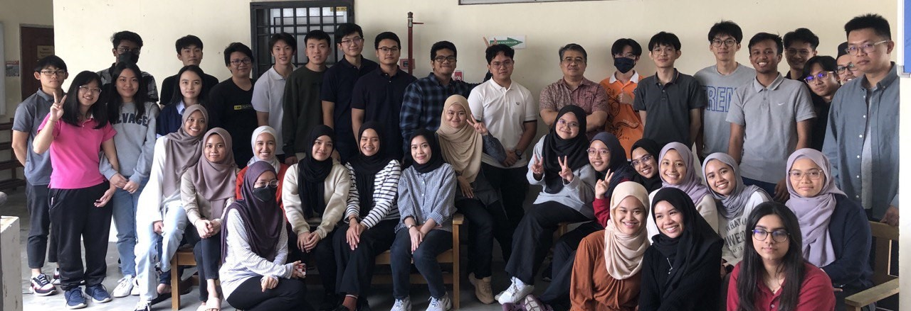

# 👋 Welcome!

   

## About Us

The information on this e-book is part of the materials for the subject High Performance Data Processing (SECP3133). This folder contains general Exploratory Data Analysis (EDA) information as well as EDA case studies using Malaysian datasets. This case study was created by a [Bachelor of Computer Science (Data Engineering)](https://comp.utm.my/bachelor-of-computer-science-data-engineering/), Universiti Teknologi Malaysia student.

<figure><figcaption></figcaption></figure>

## Videos

* [Exploratory Data Analysis Tutorial | What Is EDA | How EDA Works | EDA In Python | Intellipaat](https://www.youtube.com/watch?v=oS12x4GjLjM)
* [Live Day 1-Live Session On EDA And Feature Engineering- Zomato Dataset](https://www.youtube.com/watch?v=F-X82zhIfBo\&t=91s)
* [Live Day 2-Live Session On EDA And Feature Engineering- Black Friday Dataset](https://www.youtube.com/watch?v=cGez1q4iOFU)
* [Live Day 3-Live Session On EDA And Feature Engineering- Flight Price Prediction Dataset](https://www.youtube.com/watch?v=v5dqavbyE-I)
* [Step By Step Process In EDA And Feature Engineering In Data Science Projects](https://www.youtube.com/watch?v=xhB-dmKmzRk)
* [Exploratory Data Analysis(EDA) of Titanic dataset](https://www.youtube.com/watch?v=Ea\_KAcdv1vs)
* [Exploratory Data Analysis (EDA) Using Python | Python Data Analysis | Python Training | Edureka](https://www.youtube.com/watch?v=-o3AxdVcUtQ)
* [Exploratory Data Analysis with Pandas Python](https://www.youtube.com/watch?v=xi0vhXFPegw)
* [How to Do Data Exploration (step-by-step tutorial on real-life dataset)](https://www.youtube.com/watch?v=OY4eQrekQvs)

## Github

* [PacktPublishing/Hands on Exploratory Data analysis with Python](https://github.com/PacktPublishing/Hands-on-Exploratory-Data-Analysis-with-Python)
* [code4kunal/eda-python-examples](https://github.com/code4kunal/eda-python-examples)
* [SouRitra01/Exploratory-Data-Analysis-EDA-in-Banking-Using-Python](https://github.com/SouRitra01/Exploratory-Data-Analysis-EDA-in-Banking-Python-Project-)
* [sandipanpaul21/EDA-in-Python](https://github.com/sandipanpaul21/EDA-in-Python)
* [vharivinay/python-eda-viz](https://github.com/vharivinay/python-eda-viz)
* [demonpratapdemon/Exploratory-Data-Analysis-EDA-and-PreProcessing](https://github.com/demonpratapdemon/Exploratory-Data-Analysis-EDA-and-PreProcessing)
* [PacktPublishing/Python-for-Data-Analysis-step-by-step-with-projects-](https://github.com/PacktPublishing/Python-for-Data-Analysis-step-by-step-with-projects-/blob/main/Solution\_practice\_exercise%2B\(eda\).ipynb)
* [sandyy2505/Cardio Good Fitness Project](https://github.com/sandyy2505/EDA)
* [ajaymache/Data analysis of used car database](https://github.com/ajaymache/data-analysis-using-python)

## 📖 Lab

<table><thead><tr><th width="77">No</th><th width="358">Dataset</th><th width="133">Colab</th><th>GitHub</th></tr></thead><tbody><tr><td>1</td><td>Boston</td><td></td><td></td></tr><tr><td>2</td><td>Car Features and MSRP</td><td></td><td></td></tr><tr><td>3</td><td>Housing Dataset</td><td></td><td></td></tr><tr><td>4</td><td>United Nations Development Corporation</td><td></td><td></td></tr></tbody></table>

