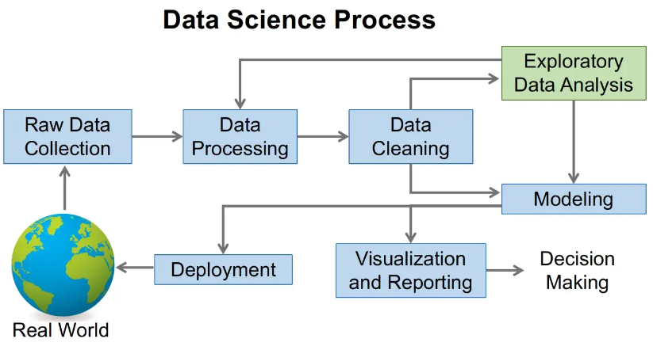

# Why EDA?

<figure><figcaption></figcaption></figure>

✅️ The main purpose of EDA is to help you look at the data before making any assumptions. In addition to better understanding the patterns in the data or detecting unusual events, it also helps you find interesting relationships between variables.

✅️ Data scientists can use exploratory analysis to ensure that the results they produce are valid and relevant to desired business outcomes and goals.

✅️ EDA also helps stakeholders by verifying that they are asking the right questions.

✅️ EDA can help to answer questions about standard deviations, categorical variables, and confidence intervals.

✅️ After the exploratory analysis is completed and the predictions are determined, its features can be used for more complex data analysis or modeling, including machine learning.
